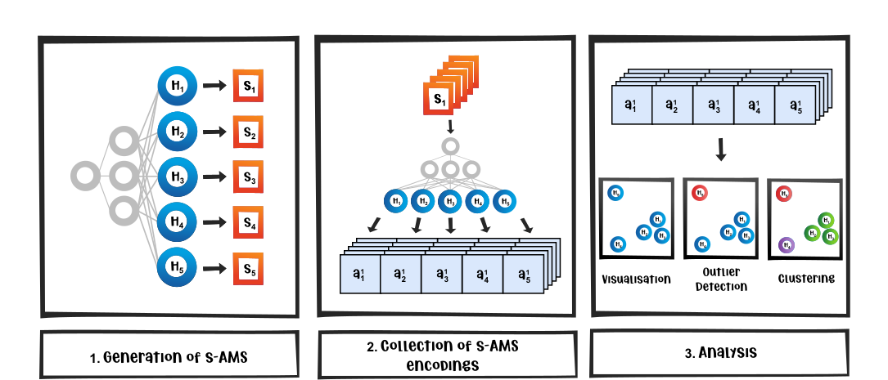

<div align="center">
  
</div>

<div align="center"><h1>DORA: Data-agnOstic Representation Analysis</h1>
<h5>A toolkit to explore the Representation Spaces of Deep Neural Networks</h5>
<h6>PyTorch version</h6>
</div>
<div align="center">

[📑 Paper link](https://arxiv.org/abs/2206.04530)

[](https://colab.research.google.com/github/lapalap/dora/blob/master/examples/hello_dora.ipynb)
[](https://github.com/lapalap/dora/actions/workflows/main.yml)
[](https://codecov.io/gh/lapalap/dora)
[](https://github.com/lapalap/dora/pulls?utf8=%E2%9C%93&q=is%3Apr%20author%3Aapp%2Fdependabot)
[](https://github.com/psf/black)
[](https://github.com/lapalap/dora/blob/master/LICENSE)

</div>


<br>
<div align="left">

</div>
<hr />

Data-agnOstic Representation analysis – *DORA* – is the automatic framework for inspecting the representation space of Deep Neural Networks for infected neurons (i.e. neurons that are representing spurious or artifactual concepts).
Independent of data, for any given DL model DORA, allows to automatically detect anomalous representations, that bear a high risk of learning unintended spurious concepts deviating from the desired decision-making policy.
Infected representations, found by DORA, can also be used as artifact detectors when applied to any given dataset – allowing furthermore an automatic detection and successive cleaning of infected data points.

<div align="center">

<figcaption>Fig.1 <b>DORA</b> – <em> Data-agnOstic Representation Analysis </em> in three steps: 1. Generation of s-AMS for a set of neurons (left), 2. Collecting the activations of the generated s-AMS of step 1 (middle), 3. Finding semantic outliers in the activation space (right).</figcaption>
</div>
<br>
With DORA user can investigate networks for presence of artifactual representations. As an example, DORA was able to found cluster of unintended (spurious) Chinese-character detector in representations from standard ImageNet trained networks.

<div align="center">

<figcaption>Fig.2 <b>Outlier Detection with DORA for ResNet18 pre-trained on ImageNet.</b> We investigate the last convolutional layer with DORA, consisting of 512 neurons, for which we compute the s-AMS respectively (DORA step 1). On the left, the activation vectors of all 512 s-AMS (DORA step 2) are plotted along with the first two UMAP components, where the highest outliers found by DORA (DORA step 3), neuron 154 and neuron 314 are marked in orange along with their closest neighbors, marked in light orange. The corresponding s-AMS for each of the marked neurons are shown in the middle. From the s-AMS of the outlier neuron 154 found by DORA, we can observe symbolic patterns, resembling Chinese symbols, represented by the neuron as well as by its closest neighbor neurons. Furthermore, on the right, each neuron is used as a detector for data points with added Chinese watermark symbols, where the performances are reported as ROC curves. We can observe that the outlier neuron 154 exhibits the highest AUC value (green curve), followed by its nearest neighbors.
</figcaption>
</div>

<br>
<div align="left">

</div>
<hr />

You can it via pip as shown below:
```
pip install git+https://github.com/lapalap/dora.git
```
<br>
<div align="left">

</div>
<hr />

You can get started either with the [colab notebook](https://colab.research.google.com/github/lapalap/dora/blob/master/examples/hello_dora.ipynb) or locally as shown below:

Let's start by analysing some neurons from the pre-trained resnet18:

```python
import torch
import torchvision.models as models
import torchvision.transforms as transforms

device = torch.device("cuda" if torch.cuda.is_available() else "cpu")
neuron_indices = [i for i in range(100, 200)]

model = models.resnet18(pretrained=True).eval().to(device)
my_transforms = transforms.Compose(
    [
        transforms.ToTensor(),
        transforms.Normalize(mean=[0.485, 0.456, 0.406], std=[0.229, 0.224, 0.225]),
    ]
)
```

And then use dora to generate synthetic activation maximization signals and collect their encodings on the same layer :sparkles:

```python
from dora import Dora
from dora.objectives import ChannelObjective

d = Dora(model=model, image_transforms=my_transforms, device=device)

d.generate_signals(
    neuron_idx=neuron_indices,
    layer=model.avgpool,
    objective_fn=ChannelObjective(),
    lr=18e-3,
    width=224,
    height=224,
    iters=90,
    experiment_name="model.avgpool",
    overwrite_experiment=True,  ## will still use what already exists if generation params are same
)

d.collect_encodings(layer=model.avgpool, experiment_name="model.avgpool")
```

Next, we can run outlier detection on our collected encodings:

```python
result = d.run_outlier_detection(
    experiment_name="model.avgpool",
    neuron_idx=neuron_indices,
    method="PCA",
    outliers_fraction=0.1,
)
```

Now let's visualize our results on an interactive app :eyes:
```python
## runs an interactive dash app on http://127.0.0.1:8050/
## set notebook_mode = True for notebooks
result.visualize()
```


<br>
<div align="left">

</div>
<hr />

```bibtex
@article{bykov2022dora,
  title={DORA: Exploring outlier representations in Deep Neural Networks},
  author={Bykov, Kirill and Deb, Mayukh and Grinwald, Dennis and M{\"u}ller, Klaus-Robert and H{\"o}hne, Marina M-C},
  journal={arXiv preprint arXiv:2206.04530},
  year={2022}
}
```
<br>
<div align="left">

</div>
<hr />

This project is licensed under the terms of the `GNU GPL v3.0` license. See [LICENSE](https://github.com/lapalap/dora/blob/master/LICENSE) for more details.
